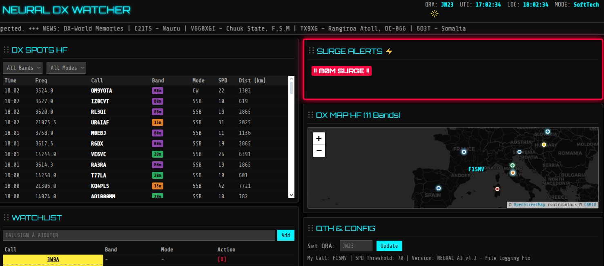

# 🛰️ NEURAL DX v4.1 - Design & Ergonomie Améliorés 🚀

## 💡 Résumé du projet

**NEURAL DX v4.1** est une station de surveillance radioamateur en temps réel. Basée sur Python/Flask (backend) et une interface web dynamique (HTML/CSS/JavaScript), cette version combine les performances des précédentes versions avec une flexibilité d'affichage et une meilleure ergonomie. Elle agrège et analyse les données de spots DX, les visualise sur des cartes en direct, calcule la distance des contacts et génère des alertes de propagation ciblées.

---

## 🆕 Nouveautés et Améliorations de la Version 4.1

Cette version se concentre sur l'amélioration de l'expérience utilisateur et de l'esthétique du tableau de bord.

* **Design des Callsigns (Nouveau) :**
    * Les indicatifs dans les tableaux DX Spots sont désormais affichés dans un **badge de type "console"** (`.callsign-badge`) en couleur d'accentuation (Néon/SoftTech) pour une lisibilité maximale et une esthétique "système".
* **Ergonomie du Dashboard :**
    * **Watchlist :** Ajout d'un champ de saisie direct dans le panneau Watchlist pour un ajout rapide d'indicatifs.
    * **Distance (km) :** Restauration de la colonne `Dist (km)` dans les tableaux HF et VHF.
* **Visualisation des Données :**
    * **Cartographie :** Le fond de carte des panneaux HF/VHF est désormais un **fond sombre/noir** pour un meilleur contraste avec les tracés de propagation.
    * **Graphiques Live :** Les graphiques "LIVE BAND ACTIVITY" (HF et VHF) utilisent à nouveau le format **Bargraph (Barres)**, plus adapté à la comparaison d'activité en temps réel que les anneaux.
* **Ordonnancement par Glisser-Déposer (Drag & Drop) :** Les panneaux d'information des colonnes latérales peuvent être réorganisés par l'utilisateur avec la souris. Cet ordre est sauvegardé dans le navigateur (`localStorage`).
* **Thèmes Dynamiques :** Le bouton `THEME` affiche désormais le nom du thème actif et bascule entre les styles disponibles (`SOFTTECH`, `DARK`).

---

## ✨ Fonctionnalités Clés

* **Calcul de distance personnalisé** basé sur votre QRA.
* **Cartographie en temps réel** (Leaflet) des spots.
* **Systèmes d'alerte SURGE** (détection d'ouvertures subites).
* **Watchlist** pour le suivi d'indicatifs spécifiques.
* **Filtres** par bande et par mode dans les spots HF et VHF.
* **Statistiques historiques** (24h) et en direct.

---

## 💻 Aperçu de l'Interface

---

## 🖱️ Utilisation de l'interface

### 1. Personnalisation de l'Affichage

* **Thèmes :** Cliquez sur le bouton `🔆` dans l'en-tête pour changer l'apparence entre **SoftTech** et **Dark Mode**.
* **Glisser-Déposer :** Cliquez et maintenez le clic sur l'icône `⋮⋮` de l'en-tête d'un panneau pour le déplacer et changer son ordre d'affichage. L'ordre est conservé au rechargement.

### 2. Saisie du QRA Locator

Dans le panneau **QTH & CONFIG** :

1.  Entrez votre QRA Locator (ex: `JN33`, `JN33BB`).
2.  Cliquez sur **Update**.
3.  Le système centre les cartes sur votre position et met à jour tous les calculs de distance.

### 3. Watchlist

* Entrez un indicatif (ex: `K1TTT`) dans le champ de saisie du panneau **WATCHLIST** et cliquez sur **Add**.
* Les spots pour cet indicatif seront mis en évidence (fond jaune).

### 4. Systèmes d'alerte

* **SURGE :** Une bannière clignotante apparaît si le nombre de spots sur une bande dépasse le seuil défini dans `webapp.py`.

### Licence MIT
feel free to modify and share . Created for the Amateur Radio Communauty by Eric F1SMV, à l'aide de #Gimini3
---